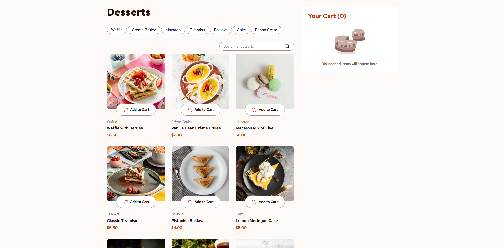
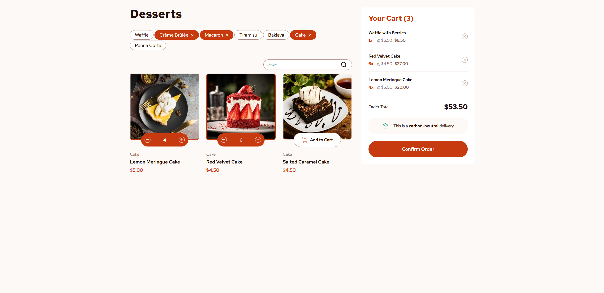
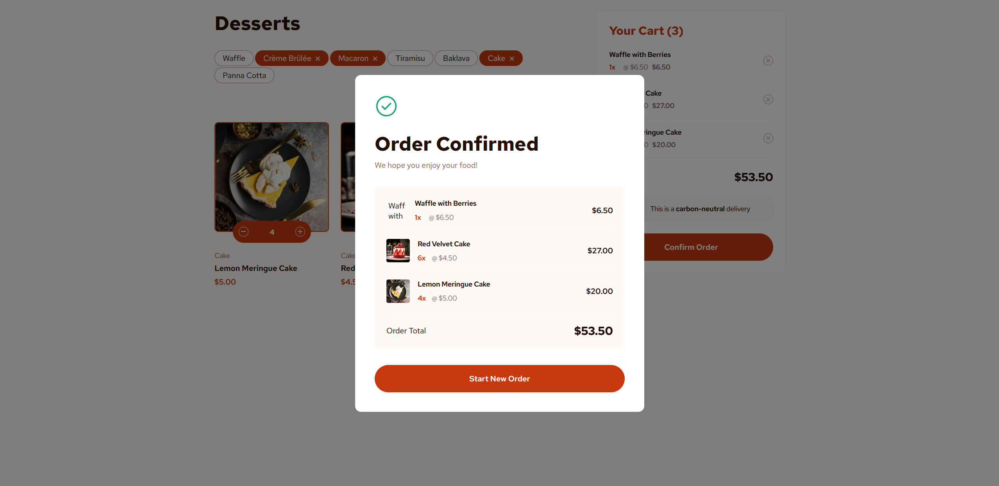
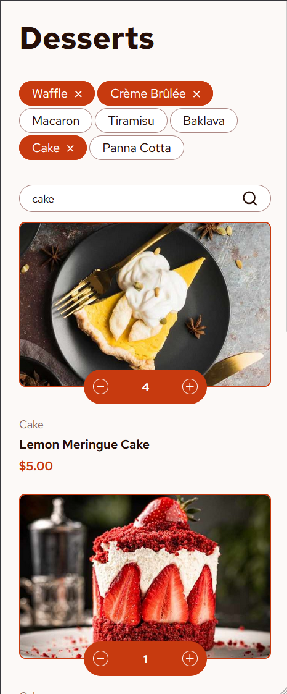
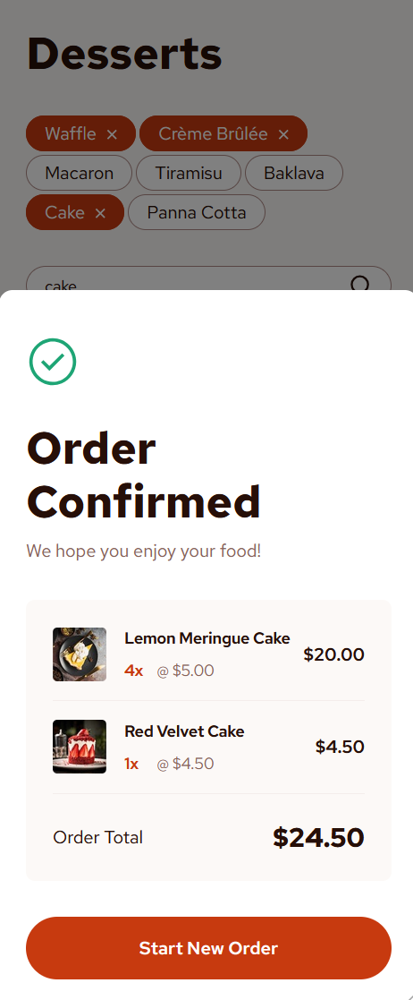

# Frontend Mentor - Product list with cart solution

This is a solution to the [Product list with cart challenge on Frontend Mentor](https://www.frontendmentor.io/challenges/product-list-with-cart-5MmqLVAp_d). Frontend Mentor challenges help you improve your coding skills by building realistic projects. 

## Table of contents

- [Overview](#overview)
  - [The challenge](#the-challenge)
  - [Screenshot](#screenshot)
  - [Links](#links)
- [My process](#my-process)
  - [Built with](#built-with)
  - [What I learned](#what-i-learned)
  - [Continued development](#continued-development)
  - [Useful resources](#useful-resources)
- [Author](#author)

## Overview

### The challenge

Users should be able to:

- Add items to the cart and remove them
- Increase/decrease the number of items in the cart
- See an order confirmation modal when they click "Confirm Order"
- Reset their selections when they click "Start New Order"
- View the optimal layout for the interface depending on their device's screen size
- See hover and focus states for all interactive elements on the page

### Screenshot







### Links

- Solution URL: [Add solution URL here](https://your-solution-url.com)
- Live Site URL: [Add live site URL here](https://your-live-site-url.com)

## My process

### Built with

- Semantic HTML5 markup
- CSS custom properties
- Flexbox
- CSS Grid
- Mobile-first workflow
- TypeScript
- [Svelte](https://svelte.dev/) - UI framework


### What I learned

Mostly I learned how to use Svelte framework (as it was my first project using it) and I'm especially happy how the elements' transitions turned out - I used Svelte's built-in transitions. I also added a filtering system and a search bar.

During this project I discovered a nice HTML element:

```html
<picture class="product-thumbnail-image">
    <source srcset={image.mobile} media="(width < 768px)" />
    <source srcset={image.tablet} media="(width < 1200px)" />
    <source srcset={image.desktop} media="(width >= 1200px)" />
    
</picture>
```

which basically lets you use different images based e.g. the screen width.

### Continued development

I want to focus on learning more Svelte to design better components and apply good practises.


### Useful resources

- [Svelte docs](https://svelte.dev/docs/svelte/overview) - Great resource which I used most often during the development of this app.

## Author

- Frontend Mentor - [@FixelDev](https://www.frontendmentor.io/profile/FixelDev)
